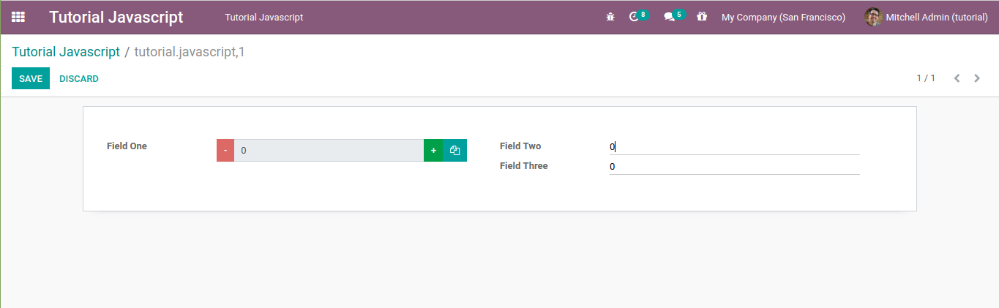

# tutorial_javascript_odoo

These modules are part of the [Odoo JavaScript Programming Tutorial](https://en.ngasturi.id/?s=javascript)s.

- [Odoo JavaScript Programming Tutorial (Part One) – Create Widget View](https://en.ngasturi.id/2021/04/24/odoo-javascript-programming-tutorial-part-one-create-widget-view/).

- [Odoo JavaScript Programming Tutorial (Part Two) – Widget Logic](https://en.ngasturi.id/2021/04/26/odoo-javascript-programming-tutorial-part-two-widget-logic/).

- [Odoo JavaScript Programming Tutorial (Part Three) – Use of jQuery](https://en.ngasturi.id/2021/05/09/odoo-javascript-programming-tutorial-part-three-use-of-jquery/).

## Tested

- Odoo 13 CE version.

## Screenshots

There are some Addon Screenshots:

### Odoo Javascript Hello World - Part One

### Create Widget View - Part One

### Widget Logic - Part Two

### Use of jQuery - Part Three

## Copyright

- [Ngasturi](https://en.ngasturi.id/).
