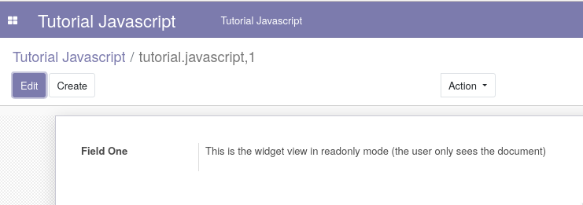
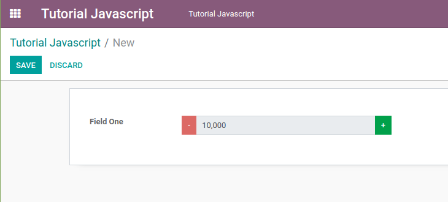

# tutorial_javascript_odoo

These modules are part of the [Odoo JavaScript Programming Tutorial](docs/index.md).

## Tested

- Odoo 13 CE version.

## Screenshots

There are some Addon Screenshots:

### Create Widget View - Part One

### Widget Logic - Part Two

### Use of jQuery - Part Three

## Copyright

- [Ngasturi](https://en.ngasturi.id/).
