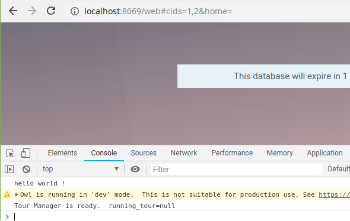
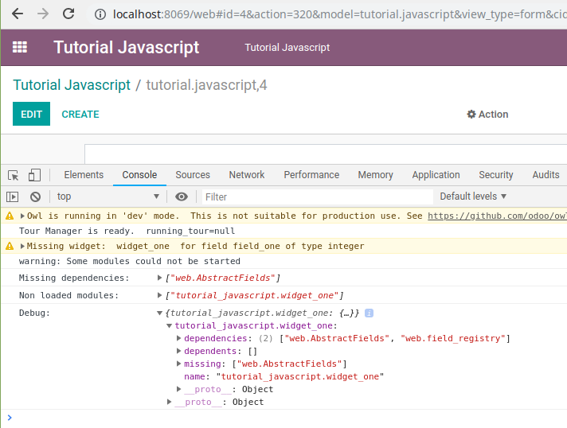
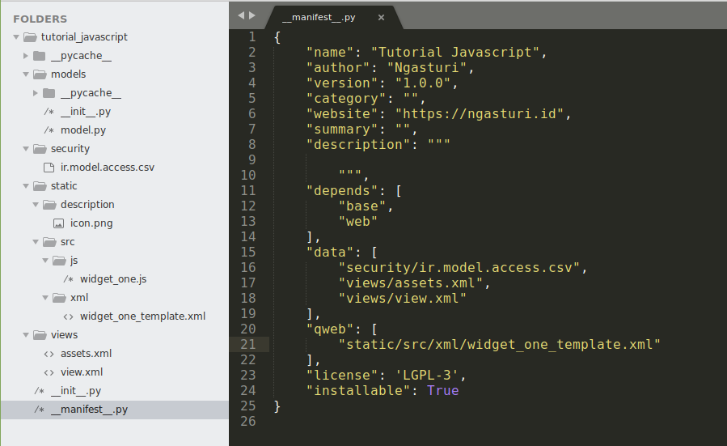
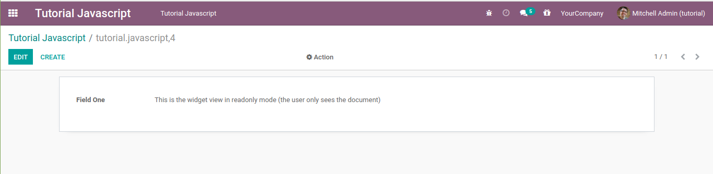

# Odoo JavaScript Programming Tutorial (Part One) -- Create Widget View

As a web-based application, for programmers who have worked on web
applications before, odoo sometimes feels a bit strange. Because we
rarely do programming with the javascript language. Almost all logic is
written on the backend with python, except when customizing the point of
sale or e-commerce module.

For you, who are starting to learn to customize the odoo module,
programming in the javascript language should be the last part that you
learn. It's better to focus on learning the python programming language
and how to write a model in odoo. Unless your first task is to customize
the point of sale or e-commerce module.

There are 3 areas where javascript is used in odoo, it's the backend,
the point of sale, and the frontend (website or e-commerce). I will
write this tutorial in several parts to cover the use of javascript in
the 3 areas above.

NOTE !!! This tutorial is written for odoo 14. It is possible that it
may not work properly on other versions of odoo.

Not many skills are needed to do javascript programming in odoo, just
basic knowledge of javascript and jquery. Generally the odoo backend
javascript code is written in the **web** module, more precisely in the
**web/static/src/js/** directory. Please see the contents of this
directory at [odoo github page](https://github.com/odoo/odoo/tree/14.0/addons/web).

In the first part of this odoo javascript programming tutorials series,
I will share how to create a widget. A widget is a part of odoo which is
used to render the value of a field. For example, the **Many2many**
field by default will be displayed in the form of a table, but if we use
the **many2many\_tags** widget the value of the field will be displayed
in the form of a chip or badge.

Another example of a widget is the **image** widget, which is usually
used to display images on the master product.

To create a widget we must load the javascript file first. Create a js
file, with any name for example **widget\_one.js**. Put this file in the
**your\_module\_name/static/src/js/** directory. Before writing the
widget code, we should test whether the **widget\_one.js** file was
successfully loaded by odoo or not by writing the console.log code as
below.

```
console.log('hello world !');
```

Next, to load the javascript file we have to create an xml file, usually
the file name is **assets.xml** which is placed in the **view**
directory, but we can also use another name. In this xml file, create a
template that inherit to the **web.assets\_backend** template, then
write the code to load the **widget\_one.js** file that we created
earlier like in the code below.

```
<?xml version="1.0" encoding="utf-8"?>
<odoo>

    <data>
        <template id="tutorial_javascript_assets_backend" inherit_id="web.assets_backend" name="assets backend">
            <xpath expr="script[last()]" position="after">
                <script type="text/javascript" src="/tutorial_javascript/static/src/js/widget_one.js"/>
            </xpath>
        </template>
    </data>

</odoo>
```

When you create a template to load a javascript file, like in the code
above, pay attention to the **inherit\_id="web.assets\_backend"**
section. If we inherit to the **web.assets\_backend** template, odoo
will put our javascript file in the backend/ERP. Therefore, the code
that we write will not run on point of sale or e-commerce.

The code used to load the javascript file is the same as the html code
in general, it's the **script** tag. You need to pay attention to the
src attribute. In this attribute, we must write the path where the file
is stored completely, including the module name. In this tutorial, my
module name is **tutorial\_javascript**.

Then load the xml file in the **\_\_manifest\_\_.py** file, restart the
odoo service, then install the module. When we refresh the browser, if
the javascript file that we created is successfully loaded by odoo, the
message should appear on the console, as shown below.



Next, in the **widget\_one.js** file, call the **odoo.define** function
with the first argument being a string. This string will be used as a
marker so the widget that we write can be inherited or overridden by
other modules. This string must be unique, therefore usually the writing
format is the name of the module followed by any text.

The second argument is a function where our's widget code should be
written.

```
odoo.define('tutorial_javascript.widget_one', function (require) {
"use strict";

    console.log('Place your widget code here');

});
```

All widgets must extend to **AbstractField** object or its child. It
also must be added to the **field\_registry** object. So let's import
those two objects first.

```
odoo.define('tutorial_javascript.widget_one', function (require) {
"use strict";

    var AbstractField = require('web.AbstractField');
    var FieldRegistry = require('web.field_registry');

});
```

When creating a widget, always enter to debug mode and activate the
developer tools, to find out if there are errors. This is an image
example that shows the odoo error message when we create a widget.





The above error message occurs because the **web.AbstractFields** object
was not found due to a typo, the correct object should be
**web.AbstractField** without the 's' at the end of the object name.

In this tutorial we will create a simple widget, for example, to display
a short message. The view of a widget can be generated via a template in
xml format, or via javascript code by overriding the **\_render**,
**\_renderEdit**, or **\_renderReadonly** methods. This time we will
make a widget view with a template, while the view with the javascript
code will be discussed at another time if I have the opportunity.

To create a template, first, create an xml file then write code like the
code below.

```
<?xml version="1.0" encoding="UTF-8"?>
<template>

    <t t-name="WidgetOneTemplate">
        <div>
            <t t-if="widget.mode == 'edit' ">
                <p>This is the widget view in edit mode (the user is editing the document)</p>
            </t>
            <t t-if="widget.mode == 'readonly' ">
                <p>This is the widget view in readonly mode (the user only sees the document)</p>
            </t>
        </div>
    </t>

</template>
```

A widget has 2 modes, it is the **edit** mode where the user is pressing
the **Create** or the **Edit** button, so he can change the contents of
the document. And the **readonly** mode where the user can only see the
document. So we have to prepare 2 different views for these two modes.

Next, save the xml file above in the
**your\_module\_name/static/src/xml** directory. And don't forget to
load it in the **\_\_manifest\_\_.py** file.

The directory structure of the module that we created and the contents
of the **\_\_manifest\_\_.py** file will look like below.



Then we just need to write the actual widget code. Please read the code
below and pay attention to the comments section.

```
odoo.define('tutorial_javascript.widget_one', function (require) {
"use strict";
    // import the required object to create a widget
    var AbstractField = require('web.AbstractField');
    var FieldRegistry = require('web.field_registry');

    // create an object with any name
    // don't forget to extend to the web.AbstractField object or its child
    var WidgetOne = AbstractField.extend({
        template: 'WidgetOneTemplate', // fill with the template name that will be rendered by odoo view widget
    });

    // register the widget to web.field_registry object
    // so we can use our widget in odoo's view/xml file
    // with the code like below
    // <field name="field_one" widget="widget_one" />
    // the 'widget_one' name is up to you, as long as it's always connected/without spaces
    FieldRegistry.add('widget_one', WidgetOne);

    // return the widget object
    // so it can be inherited or overridden by another module
    return WidgetOne;

});
```

Then we can directly use the widget that we have created in the odoo
xml/view file using the code as below.

```
<record id="tutorial_javascript_form" model="ir.ui.view">
    <field name="name">tutorial.javascript.form</field>
    <field name="model">tutorial.javascript</field>
    <field name="arch" type="xml">
        <form>
            <sheet>
                <group>
                    <field name="field_one" widget="widget_one" />
                </group>
            </sheet>
        </form>
    </field>
</record>
```

If your code doesn't have an error it will look like this.



In **edit** mode the widget template will always appear. But in
**readonly** mode, if the value of the field that use the widget that we
create is **null** or **False**, the view will be blank. So make sure to
fill the field value so the **readonly** example view mode in this
tutorial can be seen. You can change it via the database or give the
field a default value like in the code below.

```
field_one = fields.Integer('Field One', default=1)
```

You need to remember that when you edit any files in the **static**
directory, in this case including the js, css, and xml files, you don't
need to upgrade the module that you created. Just restart your odoo
service and refresh the browser.

This is the first part of the javascript programming tutorial in odoo.
Hopefully, this is useful for you.

## Source Code

-   [Download the Source Code](https://github.com/znry27/ngasturi-blog-english/tree/master/tutorial_javascript_odoo/part_one/tutorial_javascript).

## References

-   [Ngasturi Blog](https://en.ngasturi.id/).
-   [Odoo JavaScript Programming Tutorial (Part One) -- Create Widget View, April 24, 2021](https://en.ngasturi.id/2021/04/24/odoo-javascript-programming-tutorial-part-one-create-widget-view/).

