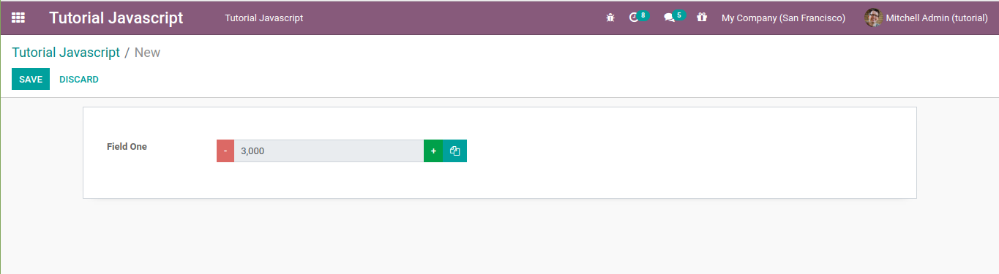
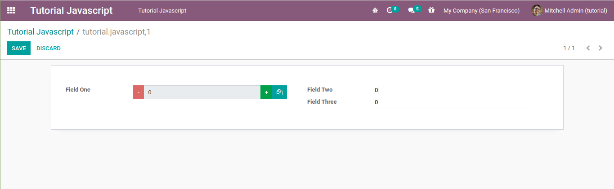
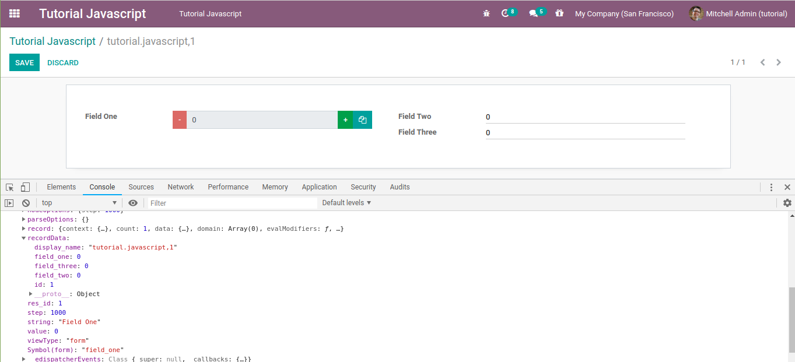
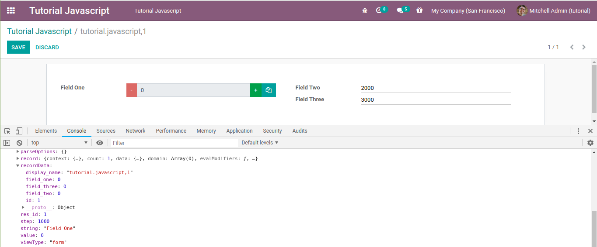
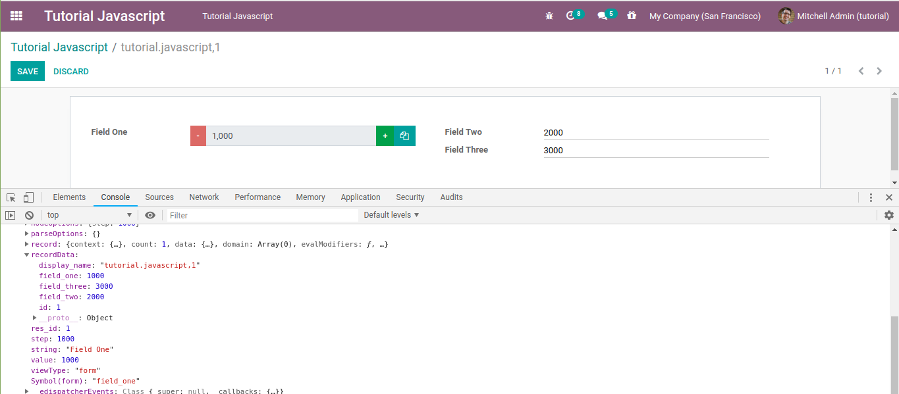
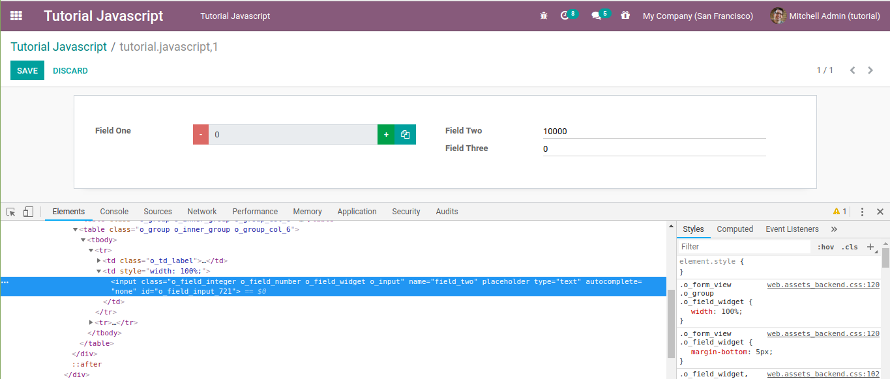

# Odoo JavaScript Programming Tutorial (Part Three) -- Use of Jquery

This article is the third part of my odoo javascript programming
tutorial series. If you haven't read the first or the second part, I
suggest you to read those articles first. You should find the link of
those articles at the bottom of this page.

In the second part, we have discussed how to add the click event to a
widget, as well as how to change the value of the field. In this part,
we will discuss how to write jquery events, get value from other
fields/widgets, and how to change the value of other fields/widgets that
are still on the same page.

First, let's add a new button to the widget that we have created in the
second part.

```
<?xml version="1.0" encoding="UTF-8"?>
<template>

    <t t-name="WidgetOneTemplate">
        <div>
            <t t-if="widget.mode == 'edit' ">
                <div class="input-group">
                    <div class="input-group-prepend">
                        <button class="btn btn-danger btn-minus"> - </button>
                    </div>
                    <input type="text" class="form-control" t-att-value="formated_value" disabled="disabled" />
                    <div class="input-group-append">
                        <button class="btn btn-success btn-plus"> + </button>
                        <!-- additional button in tutorial part three -->
                        <button class="btn btn-primary btn-copy"><i class="fa fa-copy"></i></button>
                    </div>
                </div>
            </t>
            <t t-if="widget.mode == 'readonly' ">
                <span t-esc="formated_value" />
            </t>
        </div>
    </t>

</template>
```

It will look like this.



We can write jquery code in any method, even outside the widget, but if
we want to access the elements of our widget, make sure the template is
already rendered, for example, we can write the jquery code at the
bottom of the **\_render** method.

When write a jquery event, for example the click event on a button with
the **btn-copy** class like in the code above, I don't recommend using
the **\$('.btn-copy').click()** code like in the code below.

```
_render: function () {
    // re-render the view if the field value is changed
    // format the value to include the thousand separator
    var formated_value = field_utils.format[this.formatType](this.value);
    this.$el.html($(qweb.render(this.template, {'widget': this, 'formated_value': formated_value})));
    $('.btn-copy').click(function(){
        alert('click copy button');
    });
},
```

Why ? Because based on my experience, we can not add events with the
code above to all elements. This does not mean that the code
**\$(element).click()** cannot be used, because the code below will be
executed smoothly.

```
_render: function () {
    // re-render the view if the field value is changed
    // format the value to include the thousand separator
    var formated_value = field_utils.format[this.formatType](this.value);
    this.$el.html($(qweb.render(this.template, {'widget': this, 'formated_value': formated_value})));
    $('.o_form_button_save').click(function(){
        alert('click save button');
    });
},
```

With the code above, when you click on the **Save** button, the **click
save button** message will be displayed.

The best way to add a jquery event to a widget is to use the
**this.\$el.find(element).click()**, as shown in the code below.

```
_render: function () {
    // re-render the view if the field value is changed
    // format the value to include the thousand separator
    var formated_value = field_utils.format[this.formatType](this.value);
    this.$el.html($(qweb.render(this.template, {'widget': this, 'formated_value': formated_value})));
    this.$el.find('.btn-copy').click(function(){
        alert('click on copy button');
    });
},
```

With the **this.\$el.find(element)** code, odoo will ensure that the
click event above will only be executed in one view/field only. I
recommend you to always use the **this.\$el.find(element)** code if you
want to write events with jquery, or to get the values of the elements
in the widget. As a precaution, if the widget that we make is used more
than one field in one form, or there are other widgets that use the same
class. Of course, it's not funny if the event that we write executes the
action from another widget.

Then what if we want to access values from other fields ?

As an example, let's add 2 more integer fields in the form that we have
created so that the form view will be like the image below.



Then in the jquery click event that we have created, add the
**console.log** command as shown in the code below.

```
_render: function () {
    // re-render the view if the field value is changed
    // format the value to include the thousand separator
    var self = this;
    var formated_value = field_utils.format[this.formatType](this.value);
    this.$el.html($(qweb.render(this.template, {'widget': this, 'formated_value': formated_value})));
    this.$el.find('.btn-copy').click(function(){
        console.log(self);
    });
},
```

**IMPORTANT !!!** When we write the jquery event followed by an
anonymous function, please store the value of the widget in a temporary
variable, in the example code above I save the current widget value into
a variable with the name of **self**, because in an anonymous function,
the **this** variable no longer points to the widget that we created,
but points to the element that we add an event, it is the button with
**btn-copy** class.

Restart the odoo service, then refresh your browser. In edit mode, click
the copy button then pay attention to the console tab in the developer
tools.



To get the value of a field on a form, we can see it in the
**recordData** or **record** property as shown above. In the picture
above the values of **Field Two** and **Field Three** are still **0**,
now let's change the values of the two fields above then click the copy
button again.



In the user interface the values of **Field Two** and **Field Three**
have changed, but in the console tab the values are still **0**. OK. Now
let's click the **+** or **--** button then click the copy button again.



Now the values of **Field Two** and **Field Three** in the console are
the same as the field values in the user interface.

Next, let's test it by moving the console.log code above in another
method, for example when the user clicks the **+** button as shown in
the code below.

```
btn_plus_action: function(){
    console.log(this);
    var new_value = this.value + this.step;
    this._setValue(new_value.toString());
},
```

The values of all fields should match the values displayed in the user
interface. Next try removing or commenting the
**this.\_setValue(new\_value.toString());** code above. Are the values
of all fields in the console the same as the values in the user
interface ? 🙂 It's a bit tricky to get the value of a field by accessing
the **this/self** object. However, depending on the field type,
sometimes we can still use jquery. Please inspect the input element of
**Field Two** then pay attention to the attribute of that element.



From the picture above, the input element of an integer field has a
**name** attribute with the same value as the field name. So that we can
access the value of that field with a jquery code like this.

```
_render: function () {
    // re-render the view if the field value is changed
    // format the value to include the thousand separator
    var self = this;
    var formated_value = field_utils.format[this.formatType](this.value);
    this.$el.html($(qweb.render(this.template, {'widget': this, 'formated_value': formated_value})));
    this.$el.find('.btn-copy').click(function(){
        var field_two_val = $('[name=field_two]').val();
        console.log(field_two_val);
    });
},
```

Then what if we want to change other value fields with javascript ?

To change other field values, we cannot change the **recordData** object
directly, like in the **self.recordData.field\_three = 3000;** code, but
we must call the **self.trigger\_up('field\_changed', values)** method
like in the code below.

```
_render: function () {
    // re-render the view if the field value is changed
    // format the value to include the thousand separator
    var self = this;
    var formated_value = field_utils.format[this.formatType](this.value);
    this.$el.html($(qweb.render(this.template, {'widget': this, 'formated_value': formated_value})));
    this.$el.find('.btn-copy').click(function(){
        // we can also use this code
        // self.$el.find('input').val();
        // if we want access the field one value with jquery
        // by accessing the widget element
        var field_one_val = self.value;
        var field_two_val = $('[name=field_two]').val();
        var field_three_val = field_one_val + parseInt(field_two_val);
        self.trigger_up('field_changed', {
            dataPointID: self.dataPointID,
            viewType: self.viewType,
            changes: {'field_three': field_three_val},
        });
    });
},
```

Ignore the **dataPointID** variable, just write it straight like that,
this variable usually contains the model name and an integer, I don't
know where this integer was obtained and what it is used for. While the
**viewType** variable is the view type where our widget is used, usually
a form or a tree.

What you have to pay attention to is the **changes** variable which must
be an object with a key is the name of the other field that you want to
change its value, while the value depends on the type of the field.
Since in this tutorial the **field\_three** type is an integer, the
value must be a number.

This is the end of the third part of my odoo javascript programming
tutorial series. If there is no hindrance, I would advise you to write
events like what we did in the second part of the series. Meanwhile, to
change the value of other fields, I would recommend you to use the
**\@api.onchange** decorator with python..

## Source Code

-   [Download the Source Code](https://github.com/znry27/ngasturi-blog-english/tree/master/tutorial_javascript_odoo/part_three/tutorial_javascript).

## References

-   [Ngasturi Blog](https://en.ngasturi.id/).
-   [Odoo JavaScript Programming Tutorial (Part Three) -- Use of Jquery, May 9, 2021](https://en.ngasturi.id/2021/05/09/odoo-javascript-programming-tutorial-part-three-use-of-jquery/).
