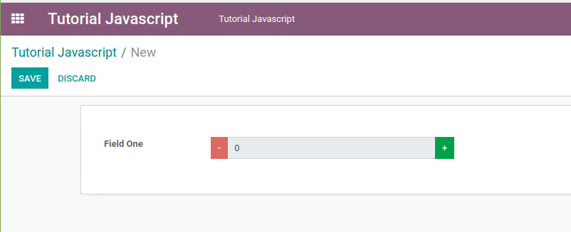
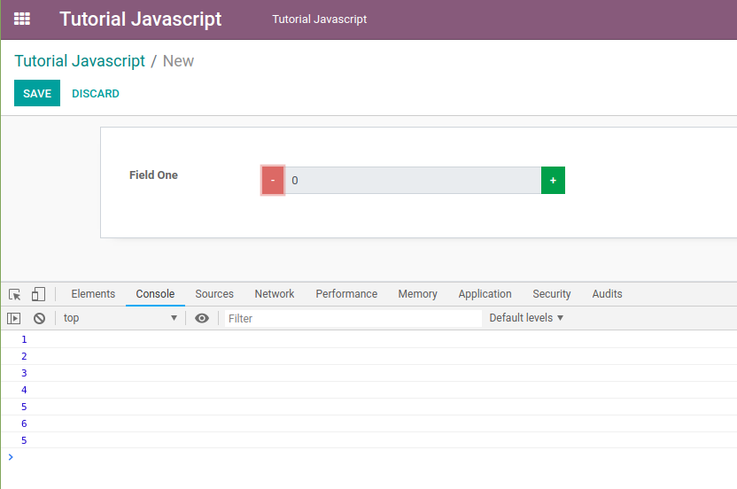
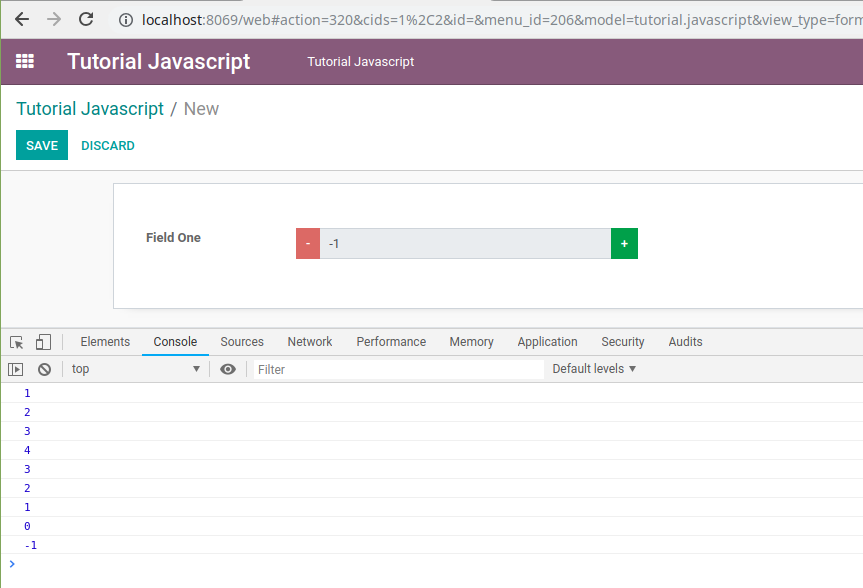
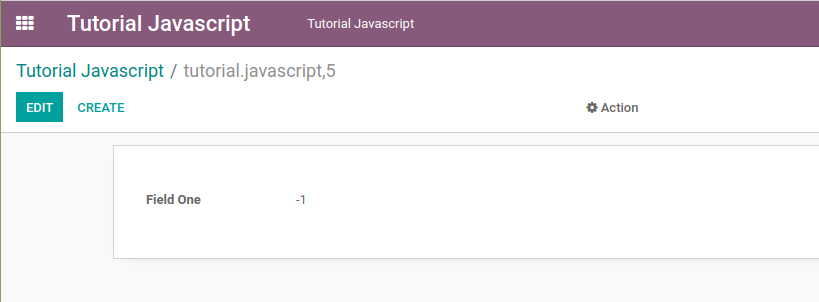
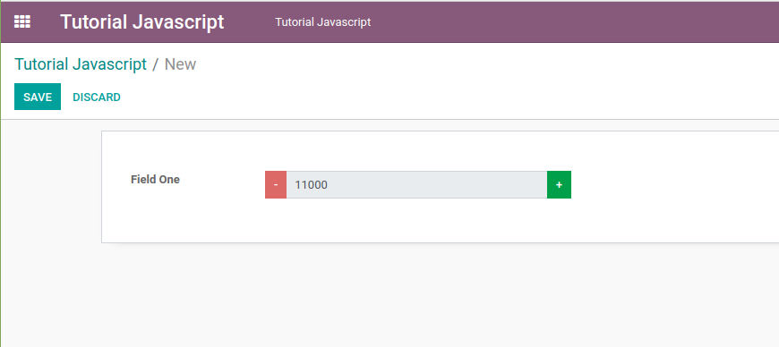

# Odoo JavaScript Programming Tutorial (Part Two) -- Widget Logic

In the first part of the odoo javascript programming tutorial series, I
have discussed how to create a simple widget, a widget that only
displays a short message to the user. In this second part, I will
discuss how to add logic to the widget that we have created in the first
part.

To follow this tutorial make sure you have created a field with the type
of **integer** like in the code below.

```javascript
field_one = fields.Integer('Field One')
```

When you create a field with the type of **integer**, when you add it to
the xml/view file, odoo will automatically render the value of that
field in an **input** element in edit **mode**, so user can change the
value directly on the **input** element earlier. In this tutorial, we
will try to change the appearance of the integer field above, which
initially can be changed freely by the user, to be a little more
limited, by adding 2 buttons. The **--** buttons to decrease the value
and the **+** buttons to increase the value. So if the user wants to
change the integer field value, he must click the **--** button or the
**+** button, it can no longer be typed freely.

First, let's change the **WidgetOneTemplate** template from the first
part of this tutorial series to display two buttons ( **-- and +** ) and
an input field that disabled in **edit** mode. Then only displays the
value in **readonly** mode, without buttons and input field.

```xml
<?xml version="1.0" encoding="UTF-8"?>
<template>

    <t t-name="WidgetOneTemplate">
        <div>
            <t t-if="widget.mode == 'edit' ">
                <div class="input-group">
                    <div class="input-group-prepend">
                        <button class="btn btn-danger btn-minus"> - </button>
                    </div>
                    <input type="text" class="form-control" t-att-value="widget.value" disabled="disabled" />
                    <div class="input-group-append">
                        <button class="btn btn-success btn-plus"> + </button>
                    </div>
                </div>
            </t>
            <t t-if="widget.mode == 'readonly' ">
                <span t-esc="widget.value" />
            </t>
        </div>
    </t>

</template>
```

In **edit** mode it will look like the image below.



Then in the **widget\_one.js** file let's add an event for each button,
like in the code below.

```javascript
var WidgetOne = AbstractField.extend({
    template: 'WidgetOneTemplate', // fill with the template name that will be rendered by odoo
    events: { // list of event, like jquery event
        'click .btn-minus': 'btn_minus_action',
        'click .btn-plus': 'btn_plus_action',
    },
    btn_minus_action: function(){
        var new_value = this.value - 1;
        this._setValue(new_value.toString());
        console.log(this.value);
    },
    btn_plus_action: function(){
        var new_value = this.value + 1;
        this._setValue(new_value.toString());
        console.log(this.value);
    },
});
```

The events in odoo are almost the same as the events in jquery, except
that they are written in reverse. In jquery if we want to write the
**click** event on a button with the **btn-minus** class we can write it
like this.

```javascript
$('.btn-minus.').click(btn_minus_action);
```

Actually, we can use the jquery code above in the odoo widget, but for
now, it is better if we use the first code, the use of jquery in the
odoo widget will be discussed at a later time if there is an
opportunity.

To change the value of a field we can use the
**this.\_setValue(new\_value)** method, but there are a few things that
you need to pay attention regarding the data type of this **new\_value**
variable, depending on the data type of the fields that use the widget
that we create. For example, in an **integer** field the variable that
we pass to the **this.\_setValue()** method must be a **string**. If it
is a **number** it will cause an error. Strange ? Not really. Because by
default we can input the field with the type of **integer** with a value
like **123,456.78** which of course is a **string**. And odoo can still
process that value as a number. Because in shadow, odoo will parse the
**new\_value** variable that in the form of a **string** to a **number**
so it can be processed in addition, subtraction, etc. operations, even
though the view display **123,456.78** which of course is not a valid
**number** value in javascript. Therefore, we have to change the
**new\_value** variable from **number** data type to **string** data
type with the **toString()** method.

Restart your odoo service, then refresh the browser, let's see the logic
that we added has been successfully executed or not.



It is not working yet. On the console the value has been changed but on
the user interface the value is still zero. Why ?

It turns out that when the value of a field has been changed, the user
interface is not automatically re-rendered by odoo. In order for the
user interface to be re-rendered when the value of a field changes, we
must override the **\_render**, or the **\_renderEdit** methods if you
want to manage the display logic between the **edit** and **readonly**
mode through javascript code. But, because in this tutorial the display
logic between the **edit** and the **readonly** mode is managed in the
**xml** file with the **t-if** attribute, we will override the
**\_render** method only.

There are several ways to change the appearance of the user interface,
the easiest way is to use the qweb. So let's import the **qweb** then
override the **\_render** method like in the code below.

```javascript
odoo.define('tutorial_javascript.widget_one', function (require) {
"use strict";
    // import the required object to create a widget
    var AbstractField = require('web.AbstractField');
    var FieldRegistry = require('web.field_registry');

    // import qweb to render a view
    var core = require('web.core');
    var qweb = core.qweb;

    // create an object with any name
    // don't forget to extend to the web.AbstractField object or its child
    var WidgetOne = AbstractField.extend({
        template: 'WidgetOneTemplate', // fill with the template name that will be rendered by odoo
        events: { // list of event, like jquery event
            'click .btn-minus': 'btn_minus_action',
            'click .btn-plus': 'btn_plus_action',
        },
        btn_minus_action: function(){
            var new_value = this.value - 1;
            this._setValue(new_value.toString());
        },
        btn_plus_action: function(){
            var new_value = this.value + 1;
            this._setValue(new_value.toString());
        },
        _render: function () {
            // re-render the view if the field value is changed
            console.log(this.value);
            this.$el.html($(qweb.render(this.template, {'widget': this})));
        },
    });

    // register the widget to web.field_registry object
    // so we can use our widget in odoo's view/xml file
    // with the code like below
    // <field name="field_one" widget="widget_one" />
    // the 'widget_one' name is up to you, as long as it's always connected/without spaces
    FieldRegistry.add('widget_one', WidgetOne);

    // return the widget object
    // so it can be inherited or overridden by another module
    return WidgetOne;

});
```

The first parameter that we have to pass in the **qweb.render** method
is the name of the template to be rendered. Meanwhile, the second
parameter is the object/data that we want to display. In the second
parameter, the key of the object we set to **widget** because in the
**WidgetOneTemplate** template we use the **widget.value** code to
display the value of the field that uses the widget that we create. We
can change the name of this key, for example, like in the code below.

```javascript
this.$el.html($(qweb.render(this.template, {'data': this})));
```

But in the **WidgetOneTemplate** template we also have to change the
code to **data.value**, otherwise it will cause an error.

Restart your odoo service, then refresh your browser. Now let's see the
values of the fields have been displayed correctly or not.



Oh, it turns out that the value is displayed correctly. Now let's click
the Save button, whether the value is stored correctly or not.



Currently, the value of the field that use the **widget\_one** widget
will increase by 1 if the user click the **+** button and will decrease
by 1 if the user click the **--** button. Then what will we do if the
user wants this addition or subtraction value can be adjusted, for
example in form A the addition or subtraction value is 1000 while in
form B the user wants the addition or subtraction value to be 3 ?

We can use the **attrs**, **options**, or **context** attributes, which
are usually included when we write a field in the xml/view file. But in
this tutorial we will use the **options** attribute to detect whether
the user configure the addition or subtraction value or not. If the user
configure it in the options attribute like in the code below.

```xml
<field name="field_one" widget="widget_one" options="{'step': 1000}"/>
```

We will make the value of the field that uses the **widget\_one** widget
will be increased or decreased by the step value configured by the user
in the xml file, which is 1000. But if the user does not configure it,
like in the code below.

```xml
<field name="field_one" widget="widget_one"/>
```

Then the value of the field that uses the **widget\_one** widget will be
increased or decreased by 1.

We can save the step value as a property of the widget, then we can use
the **init** method which will be called first automatically by odoo to
detect whether the user configures the step value or not.

```javascript
odoo.define('tutorial_javascript.widget_one', function (require) {
"use strict";
    // import the required object to create a widget
    var AbstractField = require('web.AbstractField');
    var FieldRegistry = require('web.field_registry');

    // import qweb to render a view
    var core = require('web.core');
    var qweb = core.qweb;

    // create an object with any name
    // don't forget to extend to the web.AbstractField object or its child
    var WidgetOne = AbstractField.extend({
        step: 1, // default value, if user not configure it in xml file
        template: 'WidgetOneTemplate', // fill with the template name that will be rendered by odoo
        events: { // list of event, like jquery event
            'click .btn-minus': 'btn_minus_action',
            'click .btn-plus': 'btn_plus_action',
        },
        init: function () {
            // the 'init' method is called first
            this._super.apply(this, arguments);
            if(this.nodeOptions.step){
                // if user configure the 'step' value in xml file
                // change the default value to user desired value
                this.step = this.nodeOptions.step;
            }
        },
        btn_minus_action: function(){
            var new_value = this.value - this.step;
            this._setValue(new_value.toString());
        },
        btn_plus_action: function(){
            var new_value = this.value + this.step;
            this._setValue(new_value.toString());
        },
        _render: function () {
            // re-render the view if the field value is changed
            console.log(this.value);
            this.$el.html($(qweb.render(this.template, {'widget': this})));
        },
    });

    // register the widget to web.field_registry object
    // so we can use our widget in odoo's view/xml file
    // with the code like below
    // <field name="field_one" widget="widget_one" />
    // the 'widget_one' name is up to you, as long as it's always connected/without spaces
    FieldRegistry.add('widget_one', WidgetOne);

    // return the widget object
    // so it can be inherited or overridden by another module
    return WidgetOne;

});
```

Now if the user configures the step value to 1000 in the xml file in the
**options** attribute, the field value will be increased or decreased by
1000, like in the image below.



Then what if we want to add the thousands separator ? To format currency?

We can use the **web.field\_utils** object to format currencies.
Therefore, let's import it first.

```javascript
var field_utils = require('web.field_utils');
```

Then let's change the **\_render** method to include the formatted value
with a thousand separator.

```javascript
_render: function () {
    // re-render the view if the field value is changed
    // format the value to include the thousand separator
    var formated_value = field_utils.format[this.formatType](this.value);
    this.$el.html($(qweb.render(this.template, {'widget': this, 'formated_value': formated_value})));
},
```

Then let's modify the **WidgetOneTemplate** template to display the
formatted value with a thousand separator, instead of the original
value.

```xml
<?xml version="1.0" encoding="UTF-8"?>
<template>

    <t t-name="WidgetOneTemplate">
        <div>
            <t t-if="widget.mode == 'edit' ">
                <div class="input-group">
                    <div class="input-group-prepend">
                        <button class="btn btn-danger btn-minus"> - </button>
                    </div>
                    <input type="text" class="form-control" t-att-value="formated_value" disabled="disabled" />
                    <div class="input-group-append">
                        <button class="btn btn-success btn-plus"> + </button>
                    </div>
                </div>
            </t>
            <t t-if="widget.mode == 'readonly' ">
                <span t-esc="formated_value" />
            </t>
        </div>
    </t>

</template>
```

The result will be like the image below.


OK. This is the second part of the odoo javascript tutorial series in my
blog. Hopefully, this is useful for you.

## Source Code

-   [Download the Source Code](https://github.com/znry27/ngasturi-blog-english/tree/master/tutorial_javascript_odoo/part_two/tutorial_javascript).

## References

-   [Ngasturi Blog](https://en.ngasturi.id/).
-   [Odoo JavaScript Programming Tutorial (Part Two) -- Widget Logic, April 26, 2021](https://en.ngasturi.id/2021/04/26/odoo-javascript-programming-tutorial-part-two-widget-logic/).
