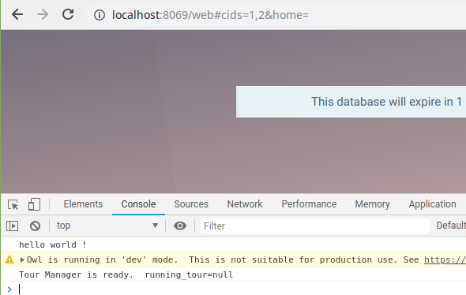
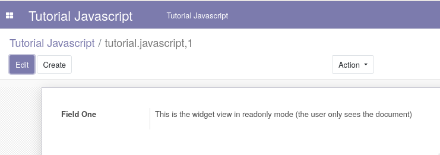

# tutorial_javascript_odoo

This module is part of the [Odoo JavaScript Programming Tutorial](https://en.ngasturi.id/?s=javascript)s.

- [Odoo JavaScript Programming Tutorial (Part One) – Create Widget View](https://en.ngasturi.id/2021/04/24/odoo-javascript-programming-tutorial-part-one-create-widget-view/).

## Tested

- Odoo 13 CE version.

## Screenshots

There are some Addon Screenshots:

### Odoo Javascript Hello World - Part One

### Create Widget View - Part One

## Copyright

- [Ngasturi](https://en.ngasturi.id/).

